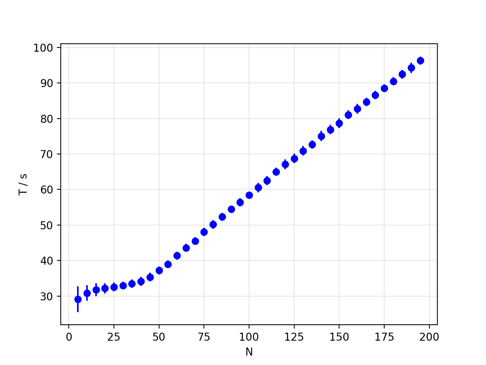

# Create N-t-diagram

This script runs several [jpscore](https://www.jupedsim.org/jpscore_introduction.html)
simulations and produces an N-t-diagram.
The script relies on a template-inifile (called masterfile) to produce [inifiles](https://www.jupedsim.org/jpscore_inifile.html).

The following actions are executed:

1. make directory **files**. If directory exists, it will be *deleted* and recreated.
2. create several inifiles in **files**:
    - with different `number` of agents
    - with different `seed` values
3. run simulations with different inifiles
4. plot N-T diagram: Output **N-T.pdf**

## Usage

Before using this script change the following parameters:

- `n_runs` (int):  how many runs
- `numbers` (list): numbers of agents.
- `master_file` (xml-file): name of master inifile.
- `jpscore`: location of the `jpscore` binary.

## Requirements

Apart from some standard Python3 libraries this script uses

- [jinja2](https://jinja2docs.readthedocs.io/en/stable/).

## Example

Following is the result of 50 runs for numbers between 5 and 200 in a [botleneck](geometry.xml).

