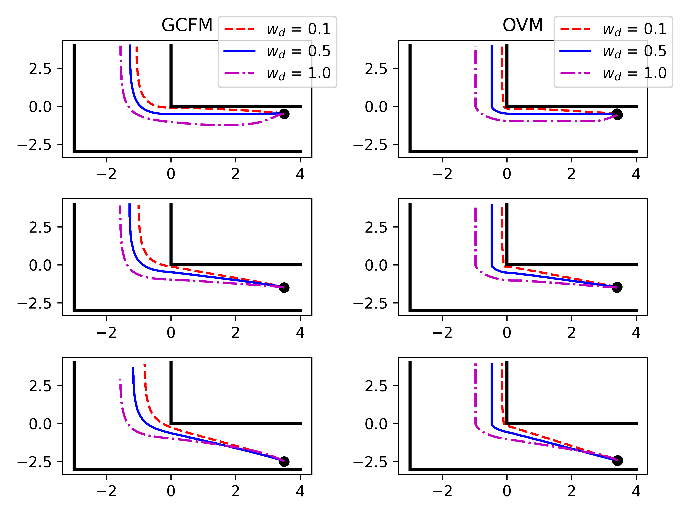

# Movement around a corner

This script runs several [jpscore](https://www.jupedsim.org/)-simulations in a
corner and tests for several models the influence of the
`wall avoidance parameter` in the floor-field router.

The script relies on a template-inifile (called masterfile) to produce [inifiles](https://www.jupedsim.org/jpscore_inifile.html).

The following actions are executed:

1. make directory **files**. If directory exists, it will be *deleted* and recreated.
2. create several inifiles in **files**:
    - with different [operational models](https://www.jupedsim.org/jpscore_operativ.html)
    - with different values of [wall_avoidance](https://www.jupedsim.org/jpscore_direction.html#strategy-8)
3. run simulations with different inifiles
4. plot result

## Usage

Before using this script change the following parameters:

- `wal_avoidance` (list)
- `jpscore`: location of the `jpscore` binary.

## Requirements

Apart from some standard Python3 libraries this script uses

- [jinja2](https://jinja2docs.readthedocs.io/en/stable/).

## Example

